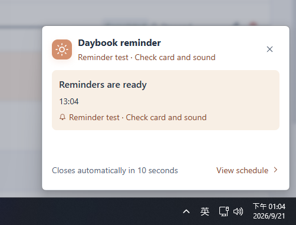

**繁體中文** · [简体中文](README.zh-CN.md) · [English](README.en.md) · [日本語](README.ja.md) · [한국어](README.ko.md)

<p align="center">
  
</p>

<h1 align="center">日序 · Daybook</h1>

<p align="center">我做了一個簡單的 Windows 桌面行程與待辦工具。<br>離線使用、不用登入，資料只留在你的電腦。</p>

<p align="center">
  
  
  <a href="LICENSE"></a>
</p>


## 下載安裝

1. 到 [下載頁面](https://github.com/Casanova033822/daybook-secretary/releases/latest)，下載 **`Daybook-Setup-版本.exe`**。
2. 開啟安裝檔，依畫面完成安裝，再啟動「日序」。

適用 **Windows x64**，目前在 Windows 11 x64 測試。不需要 Node.js，也不需要註冊；安裝後可以完全離線使用。

> 安裝檔尚未簽章，Windows 可能顯示安全警告。請只從本專案 Releases 下載；不確定來源時不要執行。

## 主要功能

- 日／週／月行程、待辦事項與重複排程。
- 開始／結束提醒，搭配桌面小卡與提示音。
- 迷你視窗、置頂與系統匣背景執行。
- 深淺色模式、14 種語言，偏好自動記住。

## 如何使用

1. **新增事項**：輸入名稱，或選一個常用事項，例如冥想、運動、早餐。
2. **安排時間**：設定開始與結束時間，需要時加上提醒或重複排程，再儲存。還沒決定時間，也能先記成待辦。
3. **查看與完成**：用日／週／月檢視查看安排；完成後勾選左側方框，需要調整時點鉛筆編輯。
4. **依習慣調整**：在「偏好設定」管理常用事項、語言與預設提醒；深淺色可直接在「新增事項」上方切換。

**需要提醒時，請讓日序保持執行。** 關閉視窗會留在系統匣；完全結束程式或電腦關機時不會提醒。

<p align="center">
  
</p>

## 隱私與授權

我不收集你的行程，也沒有廣告、遙測或雲端同步。資料存在本機，未加密，請自行備份。詳見 [安全與隱私](SECURITY.md)。

我以 [MIT 授權](LICENSE) 公開這個專案，歡迎使用、修改與分享，商用也可以。第三方素材保留[各自的授權](THIRD_PARTY_NOTICES.md)。

有問題或建議，歡迎[告訴我](https://github.com/Casanova033822/daybook-secretary/issues)。

<details>
<summary>從原始碼執行（開發者）</summary>

需要 Windows x64、Git 與 Node.js 24.x；首次下載與安裝依賴需要網路。

```powershell
git clone https://github.com/Casanova033822/daybook-secretary.git
cd daybook-secretary
npm ci
npm run build
npm start
```

開發：`npm run dev`。打包：`npm run dist`。詳見[發布流程](RELEASING.md)。

</details>
