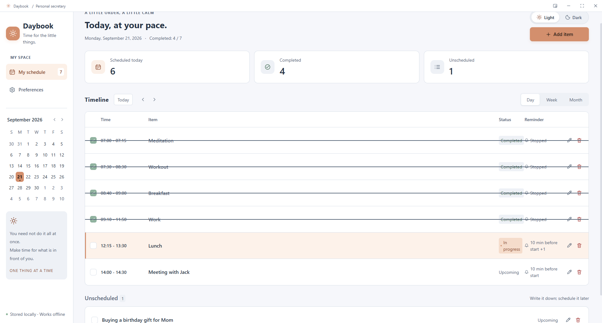
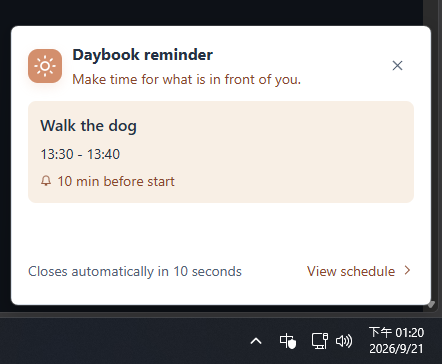

[繁體中文](README.md) · **简体中文** · [English](README.en.md) · [日本語](README.ja.md) · [한국어](README.ko.md)

<p align="center">
  
</p>

<h1 align="center">日序 · Daybook</h1>

<p align="center">我做了一个简单的 Windows 桌面日程与待办工具。<br>离线使用、不用登录，数据只留在你的电脑。</p>

<p align="center">
  
  
  <a href="LICENSE"></a>
</p>



## 下载安装

1. 到 [下载页面](https://github.com/Casanova033822/daybook-secretary/releases/latest)，下载 **`Daybook-Setup-版本.exe`**。
2. 打开安装文件，按提示完成安装，再启动「日序」。

适用于 **Windows x64**，目前在 Windows 11 x64 上测试。不需要 Node.js，也不需要注册；安装后可以完全离线使用。

> 安装文件尚未签名，Windows 可能显示安全警告。请只从本项目 Releases 下载；不确定来源时不要运行。

## 主要功能

- 日／周／月日程、待办事项与重复安排。
- 开始／结束提醒，搭配桌面卡片与提示音。
- 迷你窗口、置顶与系统托盘后台运行。
- 深浅色模式、14 种语言，自动记住偏好设置。

## 如何使用

1. **新增事项**：输入名称，或选择一个常用事项，例如冥想、运动、早餐。
2. **安排时间**：设置开始与结束时间，需要时添加提醒或重复安排，然后保存。时间未定，也可以先记成待办。
3. **查看与完成**：用日／周／月视图查看安排；完成后勾选左侧方框，需要调整时点击铅笔编辑。
4. **按习惯调整**：在「偏好设置」中管理常用事项、语言与默认提醒；深浅色可以直接在「新增事项」上方切换。

**需要提醒时，请让日序保持运行。** 关闭窗口后会留在系统托盘；完全退出程序或电脑关机时不会提醒。

<p align="center">
  
</p>

## 隐私与授权

我不收集你的日程，也没有广告、遥测或云同步。数据保存在本机，未加密，请自行备份。详见 [安全与隐私（繁体中文）](SECURITY.md)。

我以 [MIT 许可证](LICENSE) 公开这个项目，欢迎使用、修改与分享，也允许商用。第三方素材保留[各自的许可证](THIRD_PARTY_NOTICES.md)。

有问题或建议，欢迎[告诉我](https://github.com/Casanova033822/daybook-secretary/issues)。

<details>
<summary>从源代码运行（开发者）</summary>

需要 Windows x64、Git 与 Node.js 24.x；首次下载与安装依赖需要联网。

```powershell
git clone https://github.com/Casanova033822/daybook-secretary.git
cd daybook-secretary
npm ci
npm run build
npm start
```

开发：`npm run dev`。打包：`npm run dist`。详见[发布流程（繁体中文）](RELEASING.md)。

</details>
